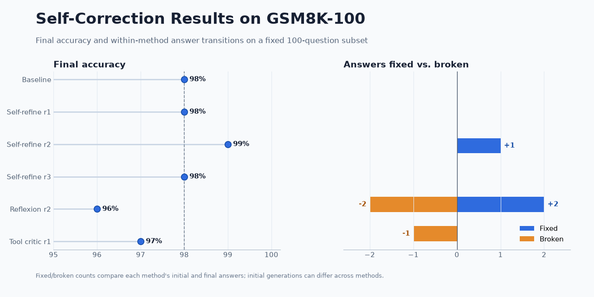
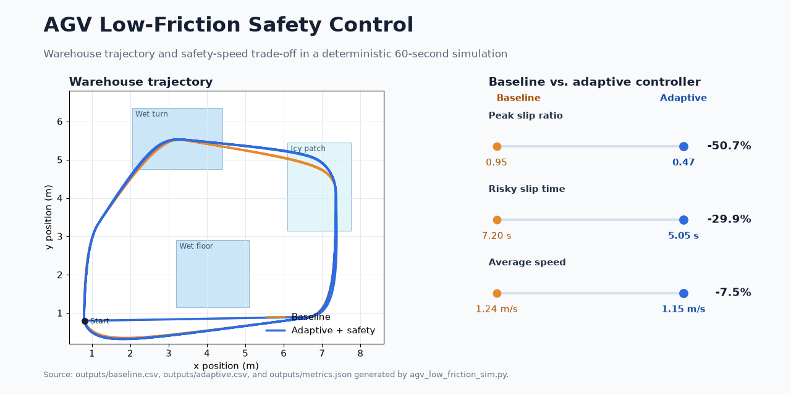
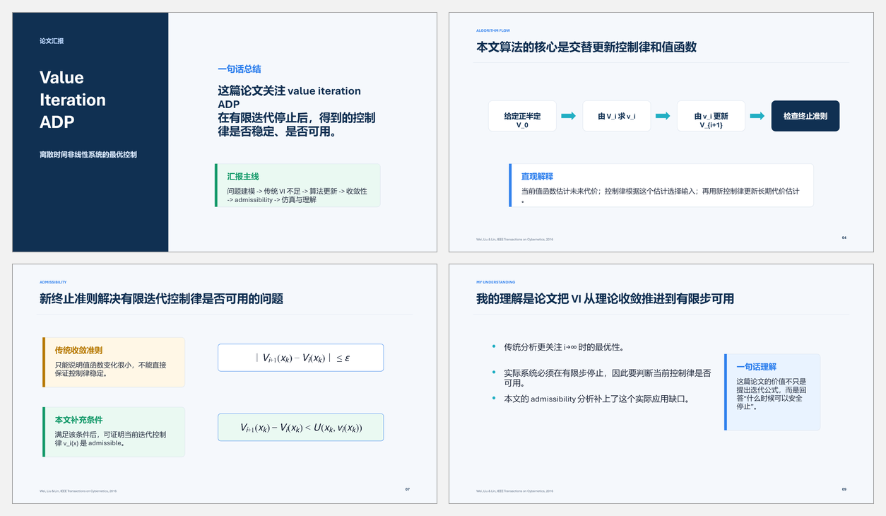

# Hi, I'm `sclm3010` 👋

**Mathematics Undergraduate · AI Agents · Reinforcement Learning · Robotics**

I build reproducible technical projects at the intersection of mathematical
reasoning, intelligent agents, control, and robotics. My work emphasizes
measurable results, honest limitations, and artifacts that other people can run
and inspect.

## Featured projects

### [SelfCorrect-Agent](https://github.com/sclm3010/SelfCorrect-Agent)

A reproducible evaluation framework for testing when LLM self-correction fixes
wrong answers—and when it breaks correct ones. It compares baseline,
self-refine, reflexion, and tool-critic strategies on a fixed GSM8K-100 subset.

`Python` · `LLM Agents` · `Evaluation` · `GSM8K` · `Reproducible Research`

---

### [AGV Low-Friction Adaptive Safety Control](https://github.com/sclm3010/agv-low-friction-control)

A warehouse AGV prototype that detects slip, estimates friction risk, and
adapts speed under wet and icy conditions. In the deterministic simulation,
peak slip fell from `0.95` to `0.47` with a `7.5%` average-speed trade-off.

`Python` · `Robotics` · `Control` · `Simulation` · `ROS 2 / Gazebo`

---

### [Value-Iteration ADP Presentation Toolkit](https://github.com/sclm3010/adp-presentation-toolkit)

A ten-slide technical explanation of value-iteration adaptive dynamic
programming, including convergence, admissibility, finite-iteration stopping,
and critic/action network implementation.

`Adaptive Dynamic Programming` · `Value Iteration` · `Technical Communication`

## Technical focus

- **AI agents:** evaluation, self-correction, structured traces, failure review.
- **Control and robotics:** simulation, adaptive control, safety constraints,
  ROS 2 / Gazebo workflows.
- **Mathematical computing:** optimization, numerical methods, and reproducible
  experiments.
- **Communication:** technical reports, presentation tooling, and clear project
  documentation.

## Tools

## Current direction

I am continuing to develop projects in AI-agent reliability, reinforcement
learning, adaptive dynamic programming, and safe autonomous systems.
